# 나만의 프롬프트 관리 프로그램

Python과 Git 기초 학습을 위해 만든 **콘솔 기반 프롬프트 관리 프로그램**입니다.  
프롬프트를 제목·내용·카테고리별로 등록하고, 목록 조회·검색·상세 보기·즐겨찾기 관리를 할 수 있으며, 보너스 기능으로 JSON 저장/불러오기, Markdown 내보내기, 수정·삭제, 조회수 TOP 목록도 지원합니다.

이 프로그램은 Python 표준 라이브러리인 `json`만 사용하므로 별도의 외부 패키지를 설치하지 않아도 실행할 수 있습니다.

---

## 프로그램 소개

프로그램이 시작되면 `INITIAL_PROMPTS`에 들어 있는 3개의 기본 프롬프트를 복사하여 작업용 `prompts` 목록을 만듭니다.

기본 프롬프트는 다음과 같습니다.

1. **중학생 대상 역사 선생님 AI** — 텍스트 생성
2. **스마트 물병 브랜드 레퍼런스 이미지 제작** — 이미지 생성
3. **구글폼 입력 결과 이메일 자동 발송** — 자동화

각 프롬프트는 Python의 딕셔너리 형태로 관리되며 다음 정보를 가집니다.

```python
{
    "title": "프롬프트 제목",
    "content": "프롬프트 전체 내용",
    "category": "카테고리",
    "favorite": False,
    "view_count": 0
}
```

- `title`: 프롬프트 제목
- `content`: 실제 프롬프트 내용
- `category`: 텍스트 생성, 이미지 생성, 자동화 등 분류
- `favorite`: 즐겨찾기 여부
- `view_count`: 상세 보기 횟수

기본 카테고리는 다음 6개입니다.

- 텍스트 생성
- 이미지 생성
- 영상 생성
- 페르소나
- 자동화
- 기타

카테고리를 입력할 때는 목록의 번호를 선택할 수도 있고, 필요한 경우 카테고리 이름을 직접 입력할 수도 있습니다.

---

## 주요 기능

| 번호 | 기능 | 설명 |
|---:|---|---|
| 1 | 프롬프트 추가 | 제목·내용·카테고리를 입력하여 새 프롬프트를 추가 |
| 2 | 프롬프트 목록 | 번호·카테고리·제목·즐겨찾기 여부를 목록으로 표시 |
| 3 | 카테고리별 조회 | 선택한 카테고리에 해당하는 프롬프트만 표시 |
| 4 | 프롬프트 검색 | 제목 또는 내용에 검색어가 포함된 프롬프트 검색 |
| 5 | 프롬프트 상세 보기 | 제목·카테고리·즐겨찾기·조회수·전체 내용 표시 |
| 6 | 즐겨찾기 관리 | 선택한 프롬프트의 즐겨찾기를 추가하거나 해제 |
| 7 | 즐겨찾기 목록 | 즐겨찾기된 프롬프트만 모아서 표시 |
| 8 | JSON 저장 | 현재 프롬프트 데이터를 `prompts.json`으로 저장 |
| 9 | JSON 불러오기 | `prompts.json`의 데이터를 현재 프로그램으로 불러오기 |
| 10 | Markdown 내보내기 | 카테고리별로 정리하여 `prompts_by_category.md` 생성 |
| 11 | 프롬프트 수정 | 제목·내용을 수정하고 필요하면 카테고리 변경 |
| 12 | 프롬프트 삭제 | 삭제 여부를 다시 확인한 뒤 선택한 프롬프트 삭제 |
| 13 | 조회수 TOP 목록 | 상세 조회수가 높은 순서로 프롬프트 정렬 |
| 0 | 종료 | 프로그램 종료 |

---

## 실행 환경

- **Python 3.10 이상**
- **VSCode 권장**
- 외부 Python 패키지 설치 불필요
- 사용 표준 라이브러리: `json`

현재 과제 수행 환경에서는 Python 3.14.6으로 실행을 확인했습니다.

---

## 실행 방법

### 1. 프로젝트 폴더 열기

VSCode에서 `main.py`가 들어 있는 프로젝트 폴더를 엽니다.

예시 구조:

```text
python-prompt-manager/
├─ main.py
├─ README.md
├─ .gitignore
├─ prompts.json                # JSON 저장 기능 실행 후 생성될 수 있음
└─ prompts_by_category.md      # Markdown 내보내기 실행 후 생성될 수 있음
```

### 2. 터미널 열기

VSCode 상단 메뉴에서 **터미널 → 새 터미널**을 선택합니다.

현재 위치가 `main.py`가 있는 폴더인지 확인합니다.

Windows PowerShell에서는 다음 명령으로 현재 파일 목록을 볼 수 있습니다.

```powershell
dir
```

### 3. Python 버전 확인

```bash
python --version
```

Python 3.10 이상이면 실행할 수 있습니다.

### 4. 프로그램 실행

```bash
python main.py
```

Windows 환경에서 `python` 명령이 동작하지 않는 경우에는 다음을 사용할 수도 있습니다.

```bash
py main.py
```

### 5. 메뉴 번호 선택

정상적으로 실행되면 다음과 같은 메뉴가 표시됩니다.

```text
=== 나만의 프롬프트 관리 ===
1. 프롬프트 추가
2. 프롬프트 목록
3. 카테고리별 조회
4. 프롬프트 검색
5. 프롬프트 상세 보기
6. 즐겨찾기 관리
7. 즐겨찾기 목록
8. JSON 저장 (보너스)
9. JSON 불러오기 (보너스)
10. Markdown 내보내기 (보너스)
11. 프롬프트 수정 (보너스)
12. 프롬프트 삭제 (보너스)
13. 조회수 TOP 목록 (보너스)
0. 종료
```

원하는 기능의 번호를 입력하고 Enter를 누르면 됩니다.

---

## 빠른 사용 예시

### 전체 프롬프트 확인

```text
선택: 2
```

등록된 프롬프트의 번호·카테고리·제목·즐겨찾기 상태가 표시됩니다.

### 새 프롬프트 추가

```text
선택: 1
제목: 나의 새 프롬프트
내용: 원하는 프롬프트 내용을 입력합니다.
카테고리 번호 또는 이름: 1
```

추가한 프롬프트는 프로그램을 종료하기 전까지 같은 `prompts` 목록 안에서 유지됩니다.

### 제목 또는 내용 검색

```text
선택: 4
검색어: 선생님
```

검색어가 제목 또는 내용에 들어 있는 프롬프트를 찾습니다. 영문 검색은 대소문자를 구분하지 않도록 처리되어 있습니다.

### 상세 보기와 조회수

```text
선택: 5
프롬프트 번호 입력: 1
```

상세 보기를 할 때마다 해당 프롬프트의 `view_count`가 1씩 증가합니다.

### 즐겨찾기

```text
선택: 6
프롬프트 번호 입력: 2
```

선택한 프롬프트의 즐겨찾기 상태가 `True`와 `False` 사이에서 전환됩니다.

---

## 데이터 저장과 다시 불러오기

프로그램에서 추가·수정·즐겨찾기·조회수 변경을 한 내용은 **프로그램이 실행되는 동안에는 유지**됩니다.

그러나 프로그램을 종료하면 다음 실행 시 `INITIAL_PROMPTS`의 기본 데이터로 다시 시작합니다.  
현재 상태를 다음 실행에서도 사용하려면 종료 전에 **8번 JSON 저장**을 실행해야 합니다.

### 저장

```text
선택: 8
```

현재 프롬프트 데이터가 다음 파일에 저장됩니다.

```text
prompts.json
```

### 다음 실행에서 불러오기

프로그램을 다시 실행한 뒤:

```text
선택: 9
```

를 입력하면 `prompts.json`에 저장된 데이터가 현재 `prompts` 목록으로 복원됩니다.

`prompts.json` 파일이 없거나 JSON 형식이 잘못된 경우에는 프로그램이 종료되지 않고 안내 메시지를 표시하도록 예외 처리가 되어 있습니다.

---

## Markdown 내보내기

메뉴에서:

```text
선택: 10
```

을 실행하면 현재 프롬프트를 카테고리별로 묶어 다음 파일로 내보냅니다.

```text
prompts_by_category.md
```

생성 파일의 기본 구조는 다음과 같습니다.

```markdown
# 프롬프트 모음

## 텍스트 생성

### 프롬프트 제목

프롬프트 내용
```

---

## 입력 오류 처리

사용자가 잘못된 값을 입력해도 프로그램이 바로 종료되지 않도록 기본적인 입력 검증을 구현했습니다.

- 제목 또는 내용이 비어 있으면 다시 입력 요청
- 카테고리 번호가 범위를 벗어나면 다시 입력 요청
- 프롬프트 번호에 문자를 입력하면 안내 후 기능 종료
- 존재하지 않는 프롬프트 번호 입력 시 안내
- 메뉴에서 1~13 또는 0 이외의 값을 입력하면 다시 메뉴 표시
- JSON 파일이 없거나 형식이 잘못된 경우 예외 처리
- 프롬프트 삭제 전 `y/n`으로 재확인

---

## 프로그램 종료

메뉴에서:

```text
선택: 0
```

을 입력하면 다음 메시지와 함께 프로그램이 종료됩니다.

```text
프로그램을 종료합니다.
```

필요한 변경 내용을 다음 실행에서도 유지하려면 **종료 전에 8번 JSON 저장을 먼저 실행하는 것이 좋습니다.**

---

## 과제 수행결과 보고서

아래부터는 「Python & Git 기초 — Git과 함께하는 Python 첫 발자국」 미션의 최종 제출 요건과 실제 수행 결과를 정리한 보고서입니다.

---

# Python & Git 기초

## Git과 함께하는 Python 첫 발자국

### 최종 제출물 수행결과

| 구분 | 내용 |
|---|---|
| 작성 목적 | 미션의 「2. 최종 결과물 - 4. 제출물」을 보고서 형식으로 정리 |
| 근거 1 | 미션 원문 PDF |
| 작성일 | 2026-08-29 |

---

## 0. 한눈에 보는 최종 결과

| 항목 | 판정 | 확인 내용 |
|---|---|---|
| 동작하는 프롬프트 관리 프로그램 | **충족** | 필수 1~7번 기능 + 보너스 8~13번 기능, 기본 프롬프트 3개, 실행 중 상태 유지 확인 |
| GitHub 저장소 | **충족** | Public 저장소, 최신 README·main.py·생성 파일, 15 Commits 확인 |
| 코드 품질 | **충족** | main.py 원문에서 19개 최상위 함수로 기능별 분리 확인 |
| 제출물 4종 | **충족** | GitHub URL, 개발환경, 기능 실행 화면, `git log --oneline --graph` 증빙 확보 |
| 기능 요구 사항 | **충족** | 개발환경부터 README까지 12개 요구사항을 코드·화면으로 확인 |
| 개발 환경 | **충족** | Python 3.14.6, Git 2.55.0, VSCode, main 브랜치, GitHub 실연동(push/pull) 확인, VSCode 계정 로그인 UI 캡처 |
| 제약 사항 | **충족** | Python 3.10+, 표준 `json`만 import, 10+ 커밋, init/add/commit/push/pull/checkout/clone/merge 사용 확인 |
| 보너스 과제 | **충족** | JSON, Markdown, 수정/삭제, 조회수 기록, TOP 목록 구현·실행 확인 |

---

## 1. 「최종 결과물」 달성 현황

| 최종 결과물 | 판정 | 근거 |
|---|---|---|
| 1. 동작하는 프롬프트 관리 프로그램 | **충족** | 콘솔 번호 메뉴, 필수 7기능, 세션 내 상태 유지, 이전 미션 프롬프트 3개가 코드와 화면에서 모두 확인됨 |
| 2. GitHub 저장소 | **충족** | 공개 저장소 최신 화면에서 15 Commits, README, main.py, prompts.json, prompts_by_category.md 확인 |
| 3. 코드 품질 | **충족** | 19개 최상위 함수로 기능 분리 |
| 4. 제출물 | **충족** | URL·개발환경·실행 결과·git log 그래프 모두 확보 |

---

## 2. GitHub 저장소 URL

**GitHub 저장소:**  
<https://github.com/hahahoho12360/python-prompt-manager>

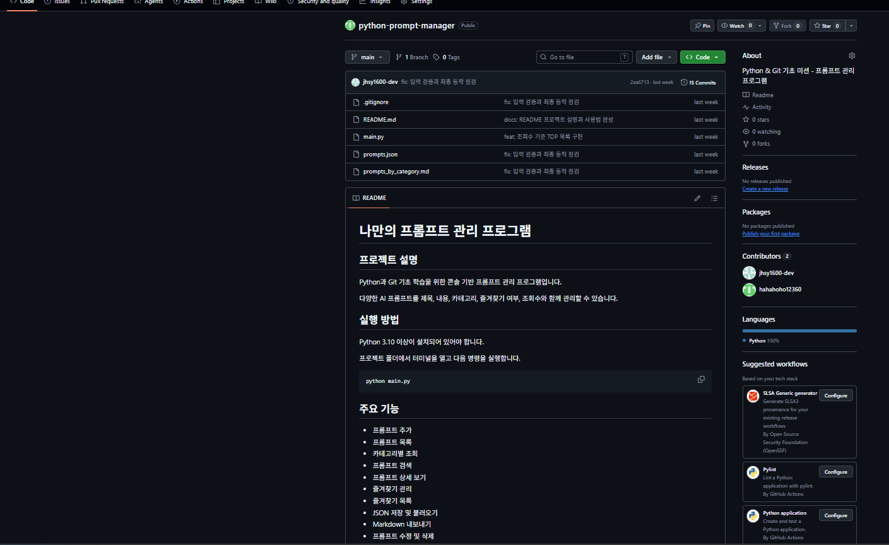

*그림 1. 최종 GitHub 저장소: Public, 15 Commits, README와 최종 파일 구성 확인*

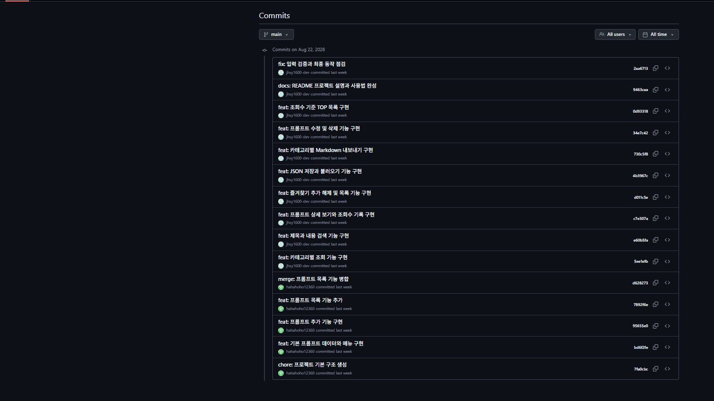

*그림 2. GitHub 커밋 목록: 기능 단위 커밋 15개 확인*

---

## 3. 동작하는 프롬프트 관리 프로그램

| 번호 | 기능 | 함수 | 원문에서 확인한 동작 |
|---:|---|---|---|
| 1 | 프롬프트 추가 | `add_prompt()` | 빈 제목/내용 재입력, 카테고리 선택/직접 입력, `favorite=False` |
| 2 | 프롬프트 목록 | `show_list()` | 번호·카테고리·제목·즐겨찾기 표시 |
| 3 | 카테고리별 조회 | `show_by_category()` | 선택 카테고리만 필터링 |
| 4 | 프롬프트 검색 | `search_prompt()` | 제목 또는 내용에서 keyword 검색 |
| 5 | 프롬프트 상세 보기 | `show_detail()` | 전체 내용, 즐겨찾기, 조회수 표시 및 +1 |
| 6 | 즐겨찾기 관리 | `manage_favorite()` | True/False 토글 |
| 7 | 즐겨찾기 목록 | `show_favorites()` | `favorite=True`만 출력 |
| 8 | JSON 저장 | `save_json()` | UTF-8, `ensure_ascii=False`, `indent=2` |
| 9 | JSON 불러오기 | `load_json()` | `FileNotFoundError` / `JSONDecodeError` 처리 |
| 10 | Markdown 내보내기 | `export_markdown()` | 카테고리별 Markdown 생성 |
| 11 | 프롬프트 수정 | `edit_prompt()` | Enter는 기존 값 유지, 카테고리 선택 변경 |
| 12 | 프롬프트 삭제 | `delete_prompt()` | y/n 재확인 후 삭제 |
| 13 | 조회수 TOP | `show_top()` | `view_count` 기준 내림차순 정렬 |

### 3-1. 기본 프롬프트 3개와 카테고리

| 기본 제목 | 카테고리 | favorite | view_count |
|---|---|---:|---:|
| 중학생 대상 역사 선생님 AI | 텍스트 생성 | True | 0 |
| 스마트 물병 브랜드 레퍼런스 이미지 제작 | 이미지 생성 | False | 0 |
| 구글폼 입력 결과 이메일 자동 발송 | 자동화 | False | 0 |

세 데이터는 모두 리스트 안의 딕셔너리로 저장되며 `title`, `content`, `category`, `favorite`, `view_count`를 가진다. 이는 필수 데이터 구조와 보너스 조회수 기록을 동시에 충족한다.

### 3-2. 실행 화면 증빙 - 목록·카테고리·검색

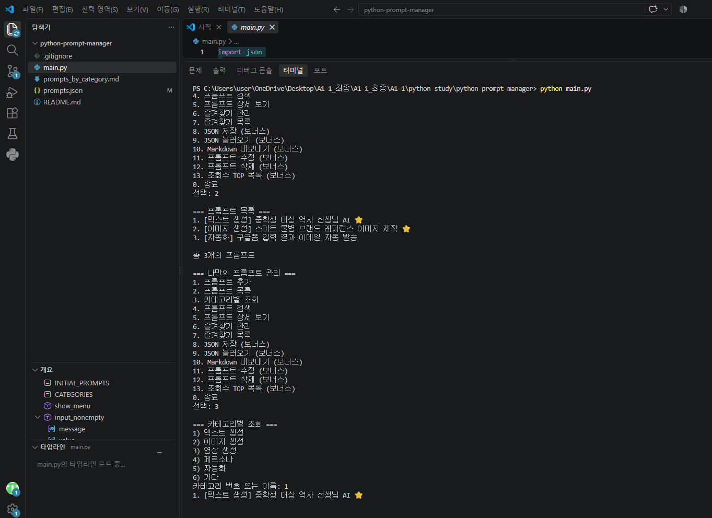

*그림 3. 프롬프트 목록과 카테고리별 조회 실행 결과*

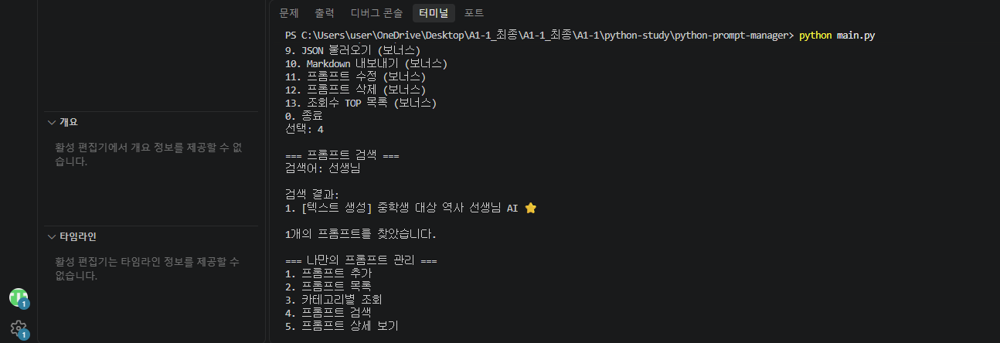

*그림 4. “선생님” 검색어로 제목/내용 검색 결과 출력*

### 3-3. 실행 화면 증빙 - 상세·즐겨찾기

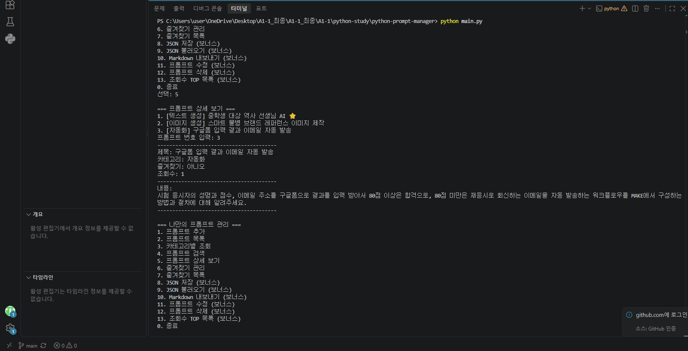

*그림 5. 상세 보기: 제목·카테고리·즐겨찾기·조회수·전체 내용 표시*

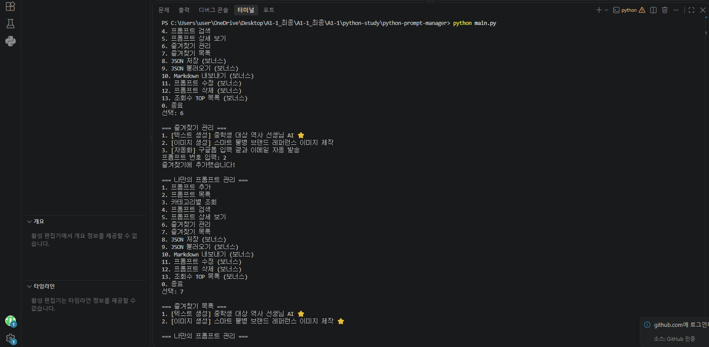

*그림 6. 즐겨찾기 추가 후 즐겨찾기 목록에 두 항목이 유지되는 화면*

---

## 4. 보너스 과제 구현 결과

| 구분 | 기능 | 판정 | 증빙 |
|---|---|---|---|
| 보너스 1-a | JSON 저장/불러오기 | **충족** | `save_json()`, `load_json()` + prompts.json 생성 및 저장/불러오기 실행 화면 |
| 보너스 1-b | Markdown 내보내기 | **충족** | `export_markdown()` + prompts_by_category.md 생성 화면 |
| 보너스 2-a | 수정/삭제 | **충족** | `edit_prompt()`, `delete_prompt()` 및 실행 화면 |
| 보너스 2-b | 조회수 기록 | **충족** | `show_detail()`에서 `view_count += 1`, 상세 화면에서 조회수 표시 |
| 보너스 2-c | 조회수 TOP | **충족** | `show_top()`에서 `sorted(..., reverse=True)`, 실제 TOP 결과 화면 |

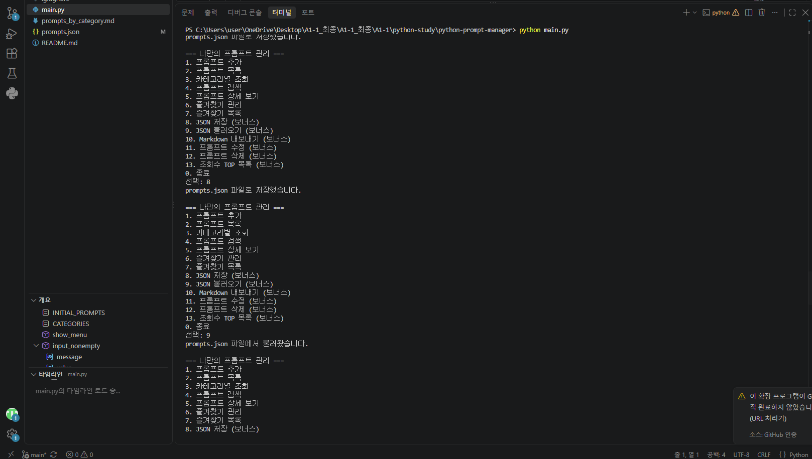

*그림 7. JSON 저장 후 불러오기 성공 화면*

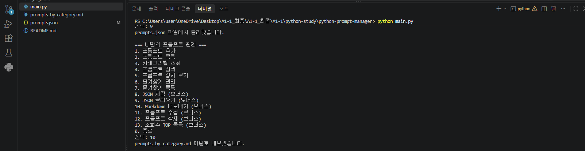

*그림 8. JSON 불러오기와 카테고리별 Markdown 내보내기 성공 화면*

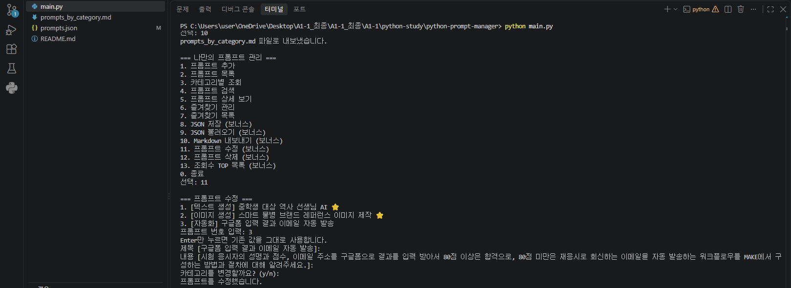

*그림 9. 프롬프트 수정 기능 실행 화면*

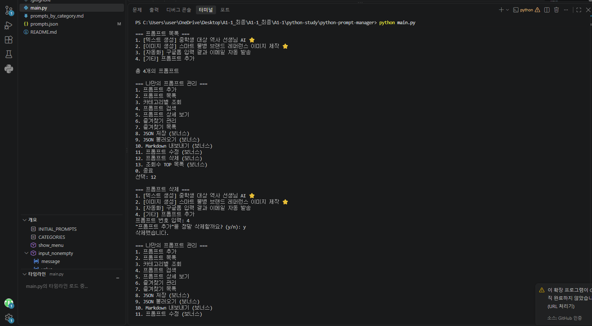

*그림 10. 프롬프트 삭제 확인 및 삭제 완료 화면*

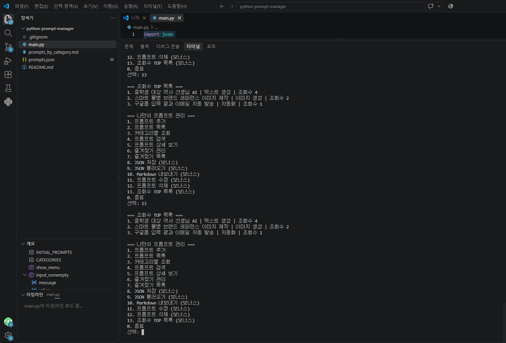

*그림 11. 조회수 4·2·1 순으로 정렬된 TOP 목록*

---

## 5. 「4. 기능 요구 사항」 충족 점검

| 기능 요구사항 | 판정 | 확인 내용 |
|---|---|---|
| 1. 개발 환경 | **충족** | Python 확장·Korean Pack, Python 3.14.6, Hello 실행, Git 2.55.0, user 설정, main 기본 브랜치, GitHub 인증/연동 확인 |
| 2. Git 저장소 설정/초기화 | **충족** | GitHub 저장소, `git init`, remote/push, `.gitignore`, README, 공개 샘플 저장소 clone 수행 |
| 3. 프로그램 실행/메뉴 | **충족** | `show_menu()` + `while True`, 잘못된 번호 안내, 0 종료, 각 기능 후 메뉴 반복 |
| 4. 기본 프롬프트 데이터 | **충족** | 이전 미션 프롬프트 3개, 리스트+딕셔너리, `title/content/category/favorite/view_count` |
| 5. 프롬프트 추가 | **충족** | 빈 입력 방지, 카테고리 선택/직접 입력, 실행 중 append, `favorite=False` |
| 6. 프롬프트 목록(브랜치) | **충족** | feature/prompt-list에서 작업 후 merge 기록, 번호/카테고리/즐겨찾기 출력 |
| 7. 카테고리별 조회 | **충족** | 목록/이름 입력, 해당 카테고리만 출력, 결과 없음 안내 |
| 8. 프롬프트 검색 | **충족** | 제목 또는 내용에서 키워드 검색, 결과 없음 안내 |
| 9. 상세 보기 | **충족** | 번호 선택, 전체 내용/제목/카테고리/즐겨찾기/조회수 표시, 오류 번호 처리 |
| 10. 즐겨찾기 관리 | **충족** | 토글 추가/해제 및 즐겨찾기 목록 |
| 11. 코드 구조 | **충족** | 19개 최상위 함수로 분리 |
| 12. README | **충족** | 프로그램 설명, 실행 방법, 기능 목록, 카테고리 및 보너스 기능이 GitHub README에 표시 |

---

## 6. 「6. 개발 환경」 충족 점검

| 환경 항목 | 판정 | 증빙 |
|---|---|---|
| VSCode 설치/설정 | **충족** | VSCode에서 main.py·README·터미널·확장 사용 |
| Python Extension | **충족** | 확장 설치 화면 확인 |
| Korean Language Pack | **충족** | 설치 화면 확인(선택 항목) |
| Python 3.10 이상 | **충족** | Python 3.14.6 |
| Hello 실행 | **충족** | hello.py / Hello World 실행 화면 |
| Git 버전 | **충족** | git version 2.55.0.windows.3 |
| Git 사용자 정보 | **충족** | `user.name` 설정 확인; 이메일은 공개본에서 마스킹 권장 |
| 기본 브랜치 main | **충족** | `git config --global init.defaultBranch` → main |
| VSCode-GitHub 연결 | **충족** | 터미널 GitHub 인증 및 push/pull 정상, VSCode 계정 UI 캡처 |

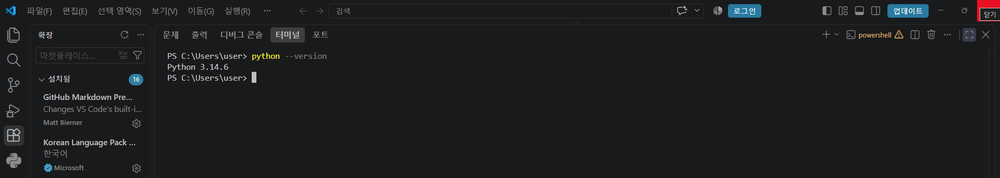

*그림 12. Python 확장 설치 및 Python 3.14.6 버전 확인*

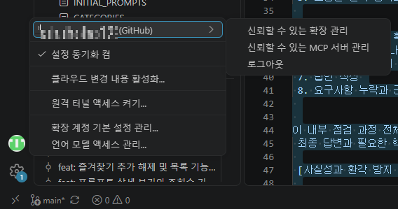

*그림 12-1. VSCode-GitHub 연결 화면*

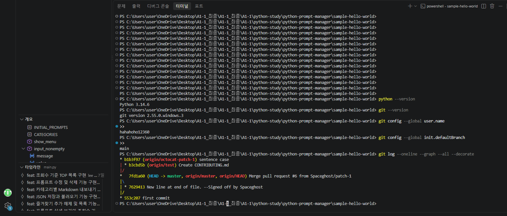

*그림 13. Python/Git 버전, Git user.name, main 기본 브랜치 확인*

---

## 7. 「7. 제약 사항」 충족 점검

| 제약 사항 | 판정 | 근거 |
|---|---|---|
| Python 3.10 이상 | **충족** | 3.14.6 사용 |
| 외부 라이브러리 없이 필수 구현 | **충족** | main.py import는 `json` 1개뿐이며 `json`은 Python 표준 라이브러리 |
| 기능별 함수 분리 | **충족** | 최상위 함수 19개 확인 |
| 의미 있는 커밋 10회 이상 | **충족** | GitHub 15 Commits 및 git log 그래프 확인 |
| init | **충족** | 초기 저장소 생성 화면 |
| add | **충족** | 기능별 커밋 과정에서 사용 |
| commit | **충족** | 15개 커밋 이력 |
| push | **충족** | `git push origin main` → `Everything up-to-date` |
| pull | **충족** | `git pull origin main` → `Already up to date` |
| checkout | **충족** | feature/prompt-list 작업 후 main 전환/merge 과정 확인 |
| clone | **충족** | octocat/Hello-World 공개 저장소를 sample-hello-world로 clone |
| merge | **충족** | `d628273 merge: 프롬프트 목록 기능 병합` |
| 브랜치 생성·병합 | **충족** | feature/prompt-list와 main 그래프 확인 |
| 이전 미션 프롬프트 3개 | **충족** | main.py `INITIAL_PROMPTS` 3개 직접 확인 |

### 7-1. push와 pull 실제 실행

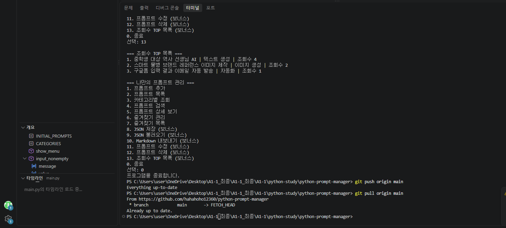

*그림 14. git push와 git pull을 실제 실행하여 최신 상태 확인*

### 7-2. 공개 저장소 clone 실제 실행

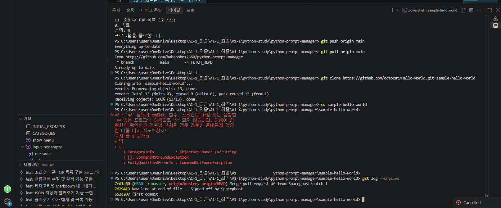

*그림 15. octocat/Hello-World 공개 저장소 clone 성공 및 clone 저장소 git log 확인*

clone 화면 중간의 PowerShell 오입력 1회는 clone 완료 뒤 발생한 단순 명령 입력 실수이며, 바로 다음 단계에서 clone 저장소에 진입하고 git log가 정상 출력되어 clone 수행 결과에는 영향을 주지 않는다.

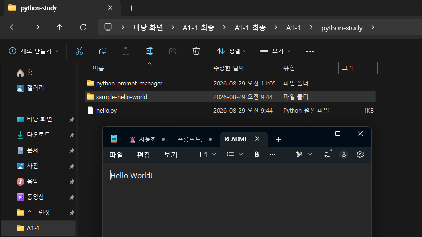

*그림 16. 실제 파일 시스템에 생성된 sample-hello-world 폴더 확인*

---

## 8. Git 브랜치·커밋·병합 이력

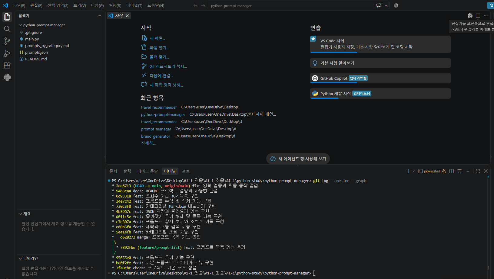

*그림 17. `git log --oneline --graph`: feature/prompt-list 분기와 main 병합, 다수 기능 커밋*

| 커밋 | 유형 | 내용 |
|---|---|---|
| `2aa6713` | fix | 입력 검증과 최종 동작 점검 |
| `9463caa` | docs | README 프로젝트 설명과 사용법 완성 |
| `0d93318` | feat | 조회수 기준 TOP 목록 구현 |
| `34e7c42` | feat | 프롬프트 수정 및 삭제 기능 구현 |
| `730c5f8` | feat | 카테고리별 Markdown 내보내기 구현 |
| `4b3967c` | feat | JSON 저장과 불러오기 기능 구현 |
| `d011c5e` | feat | 즐겨찾기 추가/해제 및 목록 기능 구현 |
| `c7e307a` | feat | 프롬프트 상세 보기와 조회수 기록 구현 |
| `e60b5fa` | feat | 제목과 내용 검색 기능 구현 |
| `5ee1efb` | feat | 카테고리별 조회 기능 구현 |
| `d628273` | merge | 프롬프트 목록 기능 병합 |
| `7892f6e` | feat | feature/prompt-list: 프롬프트 목록 기능 추가 |
| `95655e0` | feat | 프롬프트 추가 기능 구현 |
| `bd6f2fe` | feat | 기본 프롬프트 데이터와 메뉴 구현 |
| `7fa0cbc` | chore | 프로젝트 기본 구조 생성 |

### Git 요구사항 판정

기능 단위 커밋이 10개를 넘고, 별도 브랜치에서 목록 기능을 개발한 뒤 merge 커밋을 남겼으며, push/pull/clone까지 추가 증빙으로 확인되어 Git/GitHub 제약조건을 모두 충족한다.

---

## 9. 코드 품질 및 구조 분석

| 함수 | 시작 줄 | 역할 |
|---|---:|---|
| `show_menu()` | 162 | 메뉴 출력 |
| `input_nonempty()` | 179 | 빈 입력 재요청 |
| `input_category()` | 187 | 카테고리 선택/직접 입력 |
| `add_prompt()` | 208 | 프롬프트 추가 |
| `prompt_line()` | 227 | 목록 한 줄 포맷 |
| `show_list()` | 232 | 전체 목록 |
| `show_by_category()` | 244 | 카테고리 필터 |
| `search_prompt()` | 262 | 제목/내용 검색 |
| `select_prompt()` | 285 | 번호 선택·검증 |
| `show_detail()` | 307 | 상세 보기·조회수 |
| `manage_favorite()` | 332 | 즐겨찾기 토글 |
| `show_favorites()` | 349 | 즐겨찾기 목록 |
| `save_json()` | 365 | JSON 저장 |
| `load_json()` | 378 | JSON 불러오기 |
| `export_markdown()` | 396 | Markdown 내보내기 |
| `edit_prompt()` | 422 | 프롬프트 수정 |
| `delete_prompt()` | 457 | 프롬프트 삭제 |
| `show_top()` | 477 | 조회수 정렬 |
| `main()` | 497 | 메뉴 루프·기능 연결 |

### 9-1. 입력 검증과 예외 처리

- `input_nonempty()`: 빈 문자열이면 `while True`로 다시 입력을 요청한다.
- `input_category()`: 빈 값, 범위를 벗어난 숫자를 다시 요청하고 카테고리 이름 직접 입력도 허용한다.
- `select_prompt()`: 숫자가 아니거나 `1~len(prompts)` 범위를 벗어나면 `None`을 반환하고 안내한다.
- `main()`: 1~13 및 0 이외의 값은 “잘못된 번호입니다. 다시 선택해주세요.” 출력 후 메뉴를 반복한다.
- `load_json()`: 파일 없음과 JSON 형식 오류를 각각 예외 처리한다.
- `delete_prompt()`: y/n 재확인을 거쳐 삭제한다.

### 9-2. 세션 상태 유지

`main()`은 프로그램 시작 시 `INITIAL_PROMPTS`의 사본으로 `prompts` 리스트를 만들고, 하나의 `while True` 루프에서 동일한 `prompts` 객체를 모든 기능 함수에 전달한다. 따라서 `add_prompt()`의 append, `manage_favorite()`의 favorite 토글, `show_detail()`의 `view_count` 증가가 프로그램 종료 전까지 유지된다. 이는 “프로그램 실행 중 추가한 프롬프트와 즐겨찾기 상태 유지” 요구를 코드 수준에서 직접 충족한다.

---

## 10. 제출물 4종 정리

| 번호 | 제출물 | 상태 | 현재 사용 가능 자료 |
|---:|---|---|---|
| 1 | GitHub 저장소 URL | **완료** | <https://github.com/hahahoho12360/python-prompt-manager> |
| 2 | 개발 환경 설정 스크린샷 | **완료** | VSCode/Python/Git 버전·설정 화면 확보, GitHub push/pull 확인, VSCode 계정 로그인 UI 캡처 |
| 3 | 프로그램 실행 결과 스크린샷 | **완료** | 목록·카테고리·검색·상세·즐겨찾기·JSON·Markdown·수정·삭제·TOP 화면 확보 |
| 4 | `git log --oneline --graph` | **완료** | `04_git_log_graph.png` 확보 |

---

## 최종 정리

본 프로젝트는 Python 3.10 이상 환경에서 표준 라이브러리만 활용해 콘솔 기반 프롬프트 관리 프로그램을 구현하고, Git/GitHub를 이용해 기능 단위 커밋, 브랜치 생성과 병합, push/pull/clone을 수행했다. 필수 기능과 보너스 기능을 모두 구현하였고, 기능별 함수 분리와 입력 검증·예외 처리를 통해 코드 구조와 안정성을 확보하였다. 또한 GitHub 공개 저장소, 개발 환경, 프로그램 실행 결과, Git 로그 그래프 등 최종 제출에 필요한 증빙 자료를 모두 확보하였다.
